# Pepper ROS 2 Social AI Workspace

A ROS 2 Humble workspace that turns SoftBank Robotics **Pepper** into a multimodal social robot: speech in, vision context, LLM dialogue, animated speech out — plus optional navigation, MoveIt motion planning, PS4 teleoperation, and a live web dashboard.

**Author:** Vishal Shendge  
**Contact:** [shendge.vishal.vilas@gmail.com](mailto:shendge.vishal.vilas@gmail.com)  
**License:** [Apache License 2.0](LICENSE) (see [NOTICE](NOTICE) for attribution requirements)  
**Target platform:** ROS 2 Humble on Ubuntu 22.04 / NVIDIA Jetson (CUDA recommended)

---

## Table of contents

1. [Overview](#overview)
2. [Architecture](#architecture)
3. [Packages](#packages)
4. [Local `naoqi_driver` patches](#local-naoqi_driver-patches)
5. [Prerequisites](#prerequisites)
6. [Build](#build)
7. [Quick start](#quick-start)
8. [Helper scripts](#helper-scripts)
9. [Optional subsystems](#optional-subsystems)
10. [Models and external services](#models-and-external-services)
11. [Key topics and services](#key-topics-and-services)
12. [Configuration notes](#configuration-notes)
13. [Credits and acknowledgments](#credits-and-acknowledgments)
14. [Licenses](#licenses)

---

## Overview

This workspace connects Pepper’s NAOqi OS to an on-host AI stack (typically a Jetson). The default demo pipeline is:

1. **Listen** — microphone audio via `naoqi_driver`
2. **Transcribe** — Faster-Whisper + Silero VAD, with optional wake-word gating (“Hey Pepper”, …)
3. **See** — SmolVLM describes the front-camera scene
4. **Think** — social skill manager merges speech + vision and calls OpenAI GPT
5. **Speak / act** — NAOqi AnimatedSpeech (default), with optional Piper / Orpheus / Spark-TTS paths
6. **Monitor** — Flask dashboard on port 5000; optional PS4 teleop and animations

Project context in the social stack includes German-language interaction (“Architektur sozialer Fähigkeiten”).

---

## Architecture

```mermaid
flowchart LR
  subgraph Pepper["Pepper (NAOqi)"]
    MIC["Microphone"]
    CAM["Front camera"]
    SPK["Speaker / AnimatedSpeech"]
    BASE["Base + joints"]
  end

  subgraph Host["Host PC / Jetson"]
    DRV["naoqi_driver"]
    ASR["pepper_audio_transcriber\nFaster-Whisper + Silero VAD"]
    VLM["pepper_vlm\nSmolVLM"]
    LLM["openai_server\nOpenAI GPT"]
    SOC["pepper_social_skills\nsocial_skill_manager"]
    TTS["pepper_speech\nNAOqi AnimatedSpeech"]
    DASH["pepper_dashboard :5000"]
    PS4["pepper_Ps4 + joy"]
  end

  MIC --> DRV --> ASR --> SOC
  CAM --> DRV --> VLM --> SOC
  SOC <--> LLM
  SOC --> TTS --> SPK
  ASR --> DASH
  VLM --> DASH
  SOC --> DASH
  PS4 --> BASE
```



The master launch file is:

`src/pepper_bringup/launch/pepper_full_system.launch.py`

Nodes are started in a staggered order (driver → Whisper → OpenAI → VLM → speech → dashboard → teleop → social manager) so CUDA models and the robot connection have time to come up.

By default, `enable_transcription_bridge:=false` because **`social_skill_manager` replaces** the older `openai_bridge` path for LLM routing.

---

## Packages

### Application packages (this project)

| Package | Description |
|---------|-------------|
| `pepper_bringup` | Full-system launch and system monitor |
| `pepper_audio_transcriber` | Streaming Faster-Whisper ASR with Silero VAD and wake words |
| `pepper_vlm` | SmolVLM scene description from the front camera |
| `pepper_social_skills` | Social skill orchestration, gestures, NAOqi animation executor |
| `pepper_speech` | LLM text → Pepper speech (AnimatedSpeech or Orpheus TTS) |
| `pepper_dashboard` | Flask web UI for camera, transcripts, VLM, and social state |
| `pepper_Ps4` | PS4 joystick teleoperation and animation triggers |
| `pepper_piper_tts` | Piper neural TTS alternative |
| `pepper_custom_tts` | Spark-TTS HTTP server + ROS bridge alternative |
| `openai_server` | C++ ROS 2 OpenAI chat service |
| `openai_server_interfaces` | `OpenaiServer.srv` definition |
| `openai_bridge` | Legacy transcript→OpenAI→response bridge (optional) |
| `pepper_action_generation` | RViz / joint-slider gesture authoring and recording |
| `pepper_moveit2_config` | Manual MoveIt 2 configuration for Pepper on Jetson |
| `pepper_moveit2_bridge` | MoveIt trajectories → Pepper `/joint_angles` |
| `pepper_navigation` | Basic SLAM / RViz helpers |
| `pepper_semantic_navigation` | Mapping, Nav2 autonomous navigation, semantic waypoints |
| `pepper_meshes` | Local Pepper mesh assets for RViz (**CC BY-NC-ND 4.0**) |

### Upstream NAOqi / SoftBank stack

| Package | Description | Upstream |
|---------|-------------|----------|
| `naoqi_driver` (`naoqi_driver2` folder) | ROS 2 ↔ NAOqi driver (**patched fork** — see [Local `naoqi_driver` patches](#local-naoqi_driver-patches)) | [ros-naoqi/naoqi_driver2](https://github.com/ros-naoqi/naoqi_driver2) |
| `naoqi_bridge_msgs` | Custom messages / actions / services | [ros-naoqi/naoqi_bridge_msgs2](https://github.com/ros-naoqi/naoqi_bridge_msgs2) |
| `naoqi_libqi` | Aldebaran libQi (ROS 2 port) | [ros-naoqi/libqi](https://github.com/ros-naoqi/libqi) · [aldebaran/libqi](https://github.com/aldebaran/libqi) |
| `naoqi_libqicore` | libqicore layer | [ros-naoqi/libqicore](https://github.com/ros-naoqi/libqicore) · [aldebaran/libqicore](https://github.com/aldebaran/libqicore) |

---

## Local `naoqi_driver` patches

This workspace vendors a **patched** copy of [`ros-naoqi/naoqi_driver2`](https://github.com/ros-naoqi/naoqi_driver2) (based on **v2.1.1**).  
Original authors/maintainers remain credited in [Credits](#credits-and-acknowledgments); **local modifications by Vishal Shendge** make the driver more robust on Pepper / Jetson deployments where some NAOqi services or ALMemory event subscriptions are missing or unstable.

| Area | Files | What changed |
|------|-------|--------------|
| Diagnostics | `src/converters/diagnostics.cpp` | Guard `ALBodyTemperature` with try/catch; skip `setEnableNotifications` safely if the service/API is unavailable instead of crashing the driver |
| Generic events | `src/event/basic.hxx` | Try/catch around ALMemory `subscriber` creation, signal connect, and disconnect, with clear `[event]` log messages |
| Touch / bumper / head / hand | `src/event/touch.cpp`, `src/event/touch.hpp` | If ALMemory event subscription fails for a key, **fall back to polling** `ALMemory.getData` on a background thread; disable keys after repeated failures; safer disconnect/join |

These patches keep bumper / touch topics usable when NAOqi event callbacks cannot be registered, and prevent diagnostics startup from aborting the whole driver.

---

## Prerequisites

### Hardware / network

| Item | Typical value in this workspace |
|------|----------------------------------|
| Pepper IP | `192.168.100.20` (user `nao`) |
| Host / Jetson IP | `192.168.100.172` |
| Dashboard | `http://<host_ip>:5000/` |
| Optional | PS4 DualShock controller |

SSH to Pepper must work without interactive prompts for speech / animation helpers that call `qicli` or NAOqi Python APIs on the robot.

### Software

- ROS 2 **Humble**
- `colcon`, `rosdep`
- CUDA-capable GPU recommended (Whisper, SmolVLM, optional TTS models)
- System packages (examples):

```bash
sudo apt update
sudo apt install -y \
  python3-pip python3-venv git ffmpeg libsndfile1 \
  libcurl4-openssl-dev nlohmann-json3-dev \
  ros-humble-slam-toolbox ros-humble-nav2-bringup \
  ros-humble-joy ros-humble-cv-bridge
```

### Secrets / accounts

| Requirement | Used for |
|-------------|----------|
| `OPENAI_API_KEY` | GPT chat via `openai_server` |
| Hugging Face login | Spark-TTS / model downloads (`huggingface-cli login`) |
| Pepper SSH access | AnimatedSpeech, audio playback, posture scripts |

---

## Build

```bash
cd ~/pepper_ws   # or /home/robot/pepper_ws on the Jetson deploy user
source /opt/ros/humble/setup.bash

rosdep update
rosdep install --from-paths src --ignore-src --rosdistro humble -y

colcon build --symlink-install
source install/setup.bash
```

### Pepper meshes license

`pepper_meshes` ships SoftBank / Aldebaran geometry under **Creative Commons BY-NC-ND 4.0**. If you rebuild meshes from the upstream `pepper_meshes2` package, you must accept their license terms:

```bash
I_AGREE_TO_PEPPER_MESHES_LICENSE=1 colcon build --symlink-install
```

Do **not** redistribute those meshes commercially or as modified derivatives. See [Licenses](#licenses).

### Python AI dependencies

Install ML stacks into a venv (exact sets depend on which TTS / VLM paths you enable), for example:

```bash
python3 -m venv ~/pepper_venv
source ~/pepper_venv/bin/activate
pip install --upgrade pip
pip install \
  faster-whisper silero-vad \
  torch torchvision torchaudio \
  transformers accelerate pillow \
  flask opencv-python-headless soundfile
```

**Spark-TTS** (optional):

```bash
bash src/pepper_custom_tts/scripts/install_spark_tts_env.sh
```

**Orpheus TTS** (optional): Unsloth + SNAC + your local merged checkpoint under e.g.  
`~/pepper_ws/models/orpheus/orpheus-3b-tts-german-emotional-merged`

**Piper TTS** (optional): install the [Piper](https://github.com/rhasspy/piper) binary and a German voice ONNX (default path in code:  
`/usr/local/share/piper/voices/de_DE-thorsten_emotional-medium.onnx`).

---

## Quick start

### 1. Wake Pepper and disable Autonomous Life

```bash
ssh nao@192.168.100.20 \
  "qicli call ALAutonomousLife.setState disabled; qicli call ALMotion.wakeUp"
```

### 2. Launch the full social AI system

```bash
export OPENAI_API_KEY=sk-...
source /opt/ros/humble/setup.bash
source ~/pepper_ws/install/setup.bash

ros2 launch pepper_bringup pepper_full_system.launch.py \
  nao_ip:=192.168.100.20 \
  host_ip:=192.168.100.172 \
  openai_model:=gpt-4o-mini
```

Useful launch arguments (defaults shown in the launch file):

| Argument | Default | Meaning |
|----------|---------|---------|
| `nao_ip` | `192.168.100.20` | Pepper address |
| `host_ip` | `192.168.100.172` | Dashboard / host address |
| `openai_model` | `gpt-4o-mini` | OpenAI chat model |
| `require_wake_word` | `true` | Gate ASR with wake words |
| `enable_vlm` | `true` | SmolVLM scene context |
| `enable_teleop` | `true` | PS4 teleop |
| `enable_gesture_node` | `false` | Custom `/joint_angles` gestures |
| `enable_transcription_bridge` | `false` | Legacy `openai_bridge` |

Open the dashboard at `http://192.168.100.172:5000/`.

### 3. Talk to Pepper

Say a wake word (e.g. “Hey Pepper”), then your command. Whisper publishes `/whisper_transcript` → social manager → `/openai_ask` → `/openai_response` → speech on the robot.

---

## Helper scripts

These workspace-root scripts (copied for day-to-day demos) wrap launch, tablet UI, and health checks:

| Script | Role |
|--------|------|
| [`start_pepper_system.sh`](start_pepper_system.sh) | Preflight (SSH + JSON configs), kill old nodes, launch `pepper_full_system.launch.py` in a new terminal, wake Pepper, open the tablet dashboard |
| [`pepper_tablet_setup_server.py`](pepper_tablet_setup_server.py) | Flask UI on port **8787** for the Pepper tablet: enter Pepper IP, start/stop the stack, jump to the dashboard |
| [`open_dashboard.py`](open_dashboard.py) | NAOqi Python 2 snippet (run **on Pepper**) that loads the host dashboard URL in `ALTabletService` |
| [`pepper_health_check.sh`](pepper_health_check.sh) | Lists ROS 2 nodes and checks that required topics exist / are wired |

**Typical tablet flow**

```bash
# On the Jetson
cd ~/pepper_ws
python3 pepper_tablet_setup_server.py
# Open http://<jetson_ip>:8787/ on Pepper's tablet
```

**Desktop / SSH start**

```bash
export OPENAI_API_KEY=sk-...
export PEPPER_IP=192.168.100.20
export HOST_IP=192.168.100.172
bash ~/pepper_ws/start_pepper_system.sh
```

**Health check (after launch)**

```bash
bash ~/pepper_ws/pepper_health_check.sh
```

**Known gaps in the copied scripts (fix before relying on them):**

1. `start_pepper_system.sh` currently sets `OPENAI_KEY="openai-key"` instead of reading `$OPENAI_API_KEY` — export alone will not work until that line is fixed.
2. `pepper_tablet_setup_server.py` calls `~/pepper_ws/start_pepper_system_headless.sh`, which is **not** in this workspace (only `start_pepper_system.sh` exists). It also expects `~/pepper_ws/config/openai.env`.
3. `start_pepper_system.sh` uses `gnome-terminal` (needs a GUI session; not ideal for a pure headless Jetson).
4. `open_dashboard.py` hardcodes `http://192.168.100.172:5000/` — change `HOST_DASHBOARD_URL` if your Jetson IP differs (the start script already embeds a dynamic version over SSH).

---

## Optional subsystems

### OpenAI server alone

```bash
ros2 launch openai_server openai_server_launch.py \
  openai_api_key:=$OPENAI_API_KEY \
  openai_model:=gpt-4o-mini
```

### NAOqi driver alone

```bash
ros2 launch naoqi_driver naoqi_driver.launch.py nao_ip:=192.168.100.20
```

### Semantic mapping / autonomous navigation

See `src/pepper_semantic_navigation/README.md`.

```bash
# Mapping
ros2 launch pepper_semantic_navigation pepper_semantic_mapping.launch.py \
  nao_ip:=192.168.100.20 host_ip:=192.168.100.172

# Navigation with a saved map
ros2 launch pepper_semantic_navigation pepper_autonomous_navigation.launch.py \
  nao_ip:=192.168.100.20 \
  map:=$HOME/pepper_ws/maps/pepper_environment.yaml
```

**Safety:** only one publisher should drive `/cmd_vel` at a time (teleop vs Nav2).

### MoveIt 2

```bash
ros2 launch pepper_moveit2_config demo.launch.py \
  urdf_path:=$HOME/pepper_ws/src/naoqi_driver2/share/urdf/pepper.urdf
```

Bridge planned named targets to the real robot via `pepper_moveit2_bridge` (see its README). The MoveIt config was authored manually because the Setup Assistant was unreliable on Jetson/aarch64.

### Gesture authoring

```bash
ros2 launch pepper_action_generation action_generation.launch.py
# optional: send_to_real_pepper:=true
```

Saved JSON actions can feed `pepper_social_skills`.

### Alternate TTS

| Path | Package / node | Notes |
|------|----------------|-------|
| Default | `pepper_speech_node` | NAOqi `ALAnimatedSpeech` over SSH |
| Piper | `pepper_piper_tts` | Local ONNX voice → Pepper speaker |
| Orpheus | `orpheus_speech_node` | Local LLM-TTS + SNAC decoder |
| Spark-TTS | `pepper_custom_tts` | Fine-tuned Spark model via HTTP + `ALAudioPlayer` |

Do not run multiple TTS consumers of `/openai_response` at once unless you intentionally dual-route audio.

---

## Models and external services

| Component | Model / service | Role |
|-----------|-----------------|------|
| LLM | OpenAI Chat Completions (`gpt-4o-mini` default) | Dialogue |
| ASR | Faster-Whisper (`small` default, CUDA) | Speech → text |
| VAD | Silero VAD | Speech segmentation |
| VLM | [`HuggingFaceTB/SmolVLM-500M-Instruct`](https://huggingface.co/HuggingFaceTB/SmolVLM-500M-Instruct) | Scene description |
| TTS (default) | NAOqi `ALAnimatedSpeech` / `ALTextToSpeech` | Robot speech + body language |
| TTS (opt.) | Piper `de_DE-thorsten_emotional-medium` | Local neural TTS |
| TTS (opt.) | Orpheus German emotional merged checkpoint + [`hubertsiuzdak/snac_24khz`](https://huggingface.co/hubertsiuzdak/snac_24khz) | Local emotional TTS |
| TTS (opt.) | [`SparkAudio/Spark-TTS-0.5B`](https://huggingface.co/SparkAudio/Spark-TTS-0.5B) + fine-tune [`Vishalshendge3198/spark_tts_finetune`](https://huggingface.co/Vishalshendge3198/spark_tts_finetune) | Custom voice TTS |
| Face (opt.) | face-api.js project under `~/face-api-project` | Face detections |

OpenAI usage incurs API cost. Local models need disk space, GPU memory, and first-run downloads from Hugging Face.

---

## Key topics and services

| Name | Type | Role |
|------|------|------|
| `/audio` | topic | Raw microphone from NAOqi |
| `/whisper_transcript` | topic | Wake-word-filtered user speech |
| `/camera/front/image_raw` | topic | Front camera |
| `/smolvlm/output` | topic | Scene description |
| `/openai_ask` | **service** | GPT request / response |
| `/openai_response` | topic | Spoken reply text |
| `/speech` | topic | Legacy NAOqi TTS string |
| `/cmd_vel` | topic | Base velocity |
| `/joint_angles` | topic | Joint commands |
| `/pepper/animation_command` | topic | NAOqi animation triggers (e.g. PS4) |
| `/social_skill/state` | topic | Social state machine |
| `/pepper/system_monitor` | topic | Pipeline health |

---

## Configuration notes

Shared defaults live in `pepper_bringup/config/pepper_defaults.yaml`. Override with env vars or launch args:

| Variable | Purpose | Default |
|----------|---------|---------|
| `PEPPER_IP` | Robot IP | `192.168.100.20` |
| `PEPPER_HOST_IP` / `HOST_IP` | Jetson/host IP | `192.168.100.172` |
| `PEPPER_WS` | Workspace root | `~/pepper_ws` |
| `FACEAPI_PATH` | Face-API project | `~/face-api-project` |
| `OPENAI_API_KEY` | GPT access | (required) |
| `ENABLE_FACE_PIPELINE` | Start Face-API chain | `false` |

- Default social / animation configs: `pepper_social_skills/config/`
- Face pipeline (optional): `enable_face_pipeline:=true` launches preprocessor → `detection_layer` → `enhanced_tracking_layer` → `/recognized_faces` (also consumed by `social_skill_manager` + dashboard)
- Motion arbitration: `pepper_cmd_vel_mux` merges `/cmd_vel_social` > `/cmd_vel_teleop` > `/cmd_vel_nav` into `/cmd_vel` (`enable_cmd_vel_mux:=true` by default)
- Autonomous nav should keep `enable_teleop:=false` so Nav2 owns `/cmd_vel`
- Headless Jetson start: `./start_pepper_system_headless.sh`
- Default speech language is **German**; Whisper: `whisper_language:=auto`

---

## Credits and acknowledgments

This workspace builds on excellent open-source robotics, speech, and vision projects. Thank you to everyone below.

### Author

- **Vishal Shendge** — Pepper AI pipeline integration, social skills stack, dashboard, teleop, navigation/MoveIt tooling, TTS bridges, and Spark-TTS fine-tune  
  Contact: [shendge.vishal.vilas@gmail.com](mailto:shendge.vishal.vilas@gmail.com)

Please retain [NOTICE](NOTICE) and give credit when you use or redistribute this work (Apache-2.0).

### SoftBank Robotics / Aldebaran / ros-naoqi

Pepper hardware, NAOqi OS, and the ROS 2 bridge stack:

- **SoftBank Robotics / Aldebaran** — Pepper robot, NAOqi APIs (`ALAnimatedSpeech`, `ALMotion`, `ALAudioPlayer`, …), libQi / libqicore  
  Docs: [doc.aldebaran.com](http://doc.aldebaran.com/)
- **[ros-naoqi](https://github.com/ros-naoqi)** community packages:
  - [naoqi_driver2](https://github.com/ros-naoqi/naoqi_driver2) — authors/maintainers include **Karsten Knese**, **Victor Paléologue**, **Marine Chamoux**, **Maxime Busy**, **Surya Ambrose**, and SoftBank Robotics contributors  
    **Local fork in this repo:** patched by **Vishal Shendge** (diagnostics hardening, ALMemory event error handling, touch/bumper polling fallback). See [Local `naoqi_driver` patches](#local-naoqi_driver-patches).
  - [naoqi_bridge_msgs2](https://github.com/ros-naoqi/naoqi_bridge_msgs2) — **Maxime Busy** and maintainers above
  - [libqi](https://github.com/ros-naoqi/libqi) / upstream [aldebaran/libqi](https://github.com/aldebaran/libqi)
  - [libqicore](https://github.com/ros-naoqi/libqicore) / upstream [aldebaran/libqicore](https://github.com/aldebaran/libqicore)
- Upstream libQi maintainers (from package docs): **Joël Lamotte**, **Jérémy Monnon**, **Matthieu Paindavoine**, **Vincent Palancher**
- **Pepper meshes** — [ros-naoqi/pepper_meshes2](https://github.com/ros-naoqi/pepper_meshes2) (SoftBank/Aldebaran geometry, **CC BY-NC-ND 4.0**)

### OpenAI ROS 2 service

- **Sebastian Reitelshöfer** (with ChatGPT assistance) — original OpenAI ROS 2 chat server design and implementation in `openai-api-ros2-service`  
  Adapted and licensed under Apache-2.0 in this workspace; original README referenced MIT.

### Speech, vision, and ML models

| Project | Credit |
|---------|--------|
| [OpenAI](https://openai.com/) | GPT Chat Completions API |
| [Faster-Whisper](https://github.com/SYSTRAN/faster-whisper) (SYSTRAN) | Speech recognition runtime (OpenAI Whisper architecture) |
| [Silero VAD](https://github.com/snakers4/silero-vad) | Voice activity detection |
| [Hugging Face Transformers](https://github.com/huggingface/transformers) | Model loading / inference utilities |
| [SmolVLM](https://huggingface.co/HuggingFaceTB/SmolVLM-500M-Instruct) ([HuggingFaceTB](https://huggingface.co/HuggingFaceTB)) | Vision-language scene descriptions |
| [Spark-TTS](https://github.com/SparkAudio/Spark-TTS) / [SparkAudio/Spark-TTS-0.5B](https://huggingface.co/SparkAudio/Spark-TTS-0.5B) | Neural TTS base model and codebase |
| [Vishalshendge3198/spark_tts_finetune](https://huggingface.co/Vishalshendge3198/spark_tts_finetune) | Fine-tuned Spark-TTS checkpoint used in `pepper_custom_tts` |
| [Piper](https://github.com/rhasspy/piper) (Rhasspy / Open Voice OS ecosystem) | Fast local neural TTS |
| **Thorsten-Voice** German emotional Piper voice (`de_DE-thorsten_emotional-medium`) | German TTS voice model |
| **Orpheus TTS** lineage (Canopy Labs / community fine-tunes) + local `orpheus-3b-tts-german-emotional-merged` | Emotional LLM-based TTS |
| [Unsloth](https://github.com/unslothai/unsloth) | Fast fine-tune / inference helpers for Orpheus & Spark paths |
| [SNAC](https://huggingface.co/hubertsiuzdak/snac_24khz) (**Hubert Siuzdak**) | Neural audio codec decoder for Orpheus |
| [face-api.js](https://github.com/justadudewhohacks/face-api.js) ecosystem | Optional face detection front-end |

### Navigation, planning, and UI

| Project | Credit |
|---------|--------|
| [Nav2](https://github.com/ros-planning/navigation2) | Autonomous navigation |
| [slam_toolbox](https://github.com/SteveMacenski/slam_toolbox) (**Steve Macenski** and contributors) | SLAM / mapping |
| [MoveIt 2](https://github.com/moveit/moveit2) | Motion planning |
| Flask / ROS 2 `rclpy` / `rclcpp` | Dashboard and node runtimes |
| `joy` / DualShock / PS4 Linux support | Teleoperation input |

### Research / tooling context

- ROS 2 and the broader **Open Robotics** ecosystem
- NVIDIA CUDA / Jetson platform for on-robot edge inference

If you believe a credit is missing, please open an issue or contact the author — attributions will be updated.

---

## Licenses

| Component | License |
|-----------|---------|
| User-owned packages in this workspace (`pepper_*` except meshes, `openai_*`) | **Apache-2.0** — see [LICENSE](LICENSE) and [NOTICE](NOTICE) |
| `naoqi_driver` (vendored, with local patches) | **BSD** (upstream [ros-naoqi/naoqi_driver2](https://github.com/ros-naoqi/naoqi_driver2)); local patches by Vishal Shendge |
| `naoqi_libqi`, `naoqi_libqicore` | **BSD** (upstream) |
| `naoqi_bridge_msgs` | **Apache-2.0** (upstream) |
| `pepper_meshes` | **CC BY-NC-ND 4.0** (SoftBank / Aldebaran mesh data) |
| Third-party models (Whisper, SmolVLM, Spark-TTS, Piper voices, Orpheus, SNAC, …) | See each model/repo license on GitHub / Hugging Face before redistribution |

**Attribution requirement:** if you use this repository (or derivatives of the Apache-2.0 portions), keep the copyright notices, the `LICENSE`, and the `NOTICE` file so credit remains with **Vishal Shendge**.

---

## Contact

**Vishal Shendge** — [shendge.vishal.vilas@gmail.com](mailto:shendge.vishal.vilas@gmail.com)
